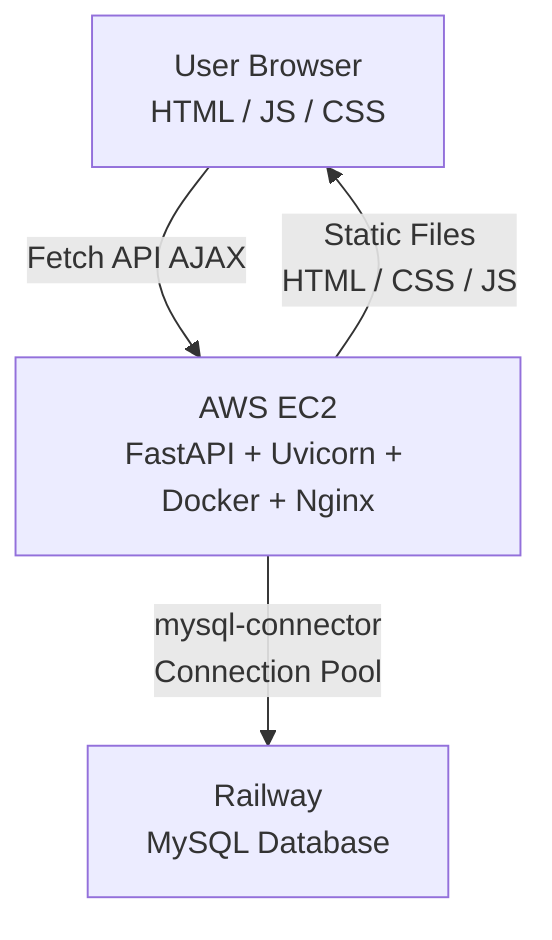

[English](./README.md) | [中文](./README.zh-TW.md)

# Taipei-Day-Trip

A full-stack e-commerce travel website for exploring and booking sightseeing trips in Taipei, with credit card payment integration via TapPay.

**Live Demo:** https://taipei-day-trip.sychcc.net/
**GitHub:** https://github.com/sychcc/taipei-day-trip/


---

## Features

- **Attraction Browsing** — Explore Taipei attractions with pagination (8 per page)
- **Search & Filter** — Search by keyword or filter by category / MRT station
- **Infinite Scroll** — Automatically loads the next page via IntersectionObserver
- **Image Slideshow** — Custom-built carousel with arrow navigation and dot indicators
- **User Authentication** — Register and login with JWT-based authentication
- **Booking System** — Book an attraction with date and time slot selection
- **Credit Card Payment** — Integrated TapPay SDK for card field rendering; payment is simulated

---

## Tech Stack

### Frontend

| Technology               | Purpose                                         |
| ------------------------ | ----------------------------------------------- |
| JavaScript (Vanilla)     | Core logic and interactivity, no framework      |
| Fetch API (AJAX)         | Asynchronous data requests                      |
| IntersectionObserver API | Infinite scroll                                 |
| localStorage             | JWT token storage                               |
| TapPay SDK (TPDirect)    | Credit card field rendering                     |
| CSS Grid                 | Attraction card layout (4-col → 2-col → 1-col)  |
| RWD (Media Queries)      | Responsive layout (breakpoints: 1250px / 600px) |
| HTML                     | Page structure                                  |

### Backend

| Technology             | Purpose                                         |
| ---------------------- | ----------------------------------------------- |
| Python                 | Backend language                                |
| FastAPI                | Web framework                                   |
| Uvicorn                | ASGI server                                     |
| RESTful API            | API design                                      |
| PyJWT                  | JWT authentication (Bearer Token, 7-day expiry) |
| mysql-connector-python | MySQL connection pool (pool_size=10)            |
| python-dotenv          | Environment variable management                 |
| MVC Pattern            | Architecture (controllers/ + models/)           |

### Database

| Technology | Purpose                                 |
| ---------- | --------------------------------------- |
| MySQL      | Relational database (hosted on Railway) |

### Deployment

| Technology     | Purpose            |
| -------------- | ------------------ |
| AWS EC2        | Application server |
| Docker         | Containerization   |
| Nginx          | Reverse proxy      |
| AWS CloudFront | HTTPS termination  |

---

## System Architecture



---

## Database Design

```
user (1)
  ├── booking (1)   user_id → user.id  UNIQUE(user_id)
  └── orders  (N)   user_id → user.id

attractions
  └── booking (N)   attraction_id → attractions.id (PK)
```

Key design decisions:

- `attractions` has two ID columns: `id` (AUTO_INCREMENT primary key, used internally) and `_id` (original data source ID, used as the API-facing attraction identifier)
- `booking` uses `ON DUPLICATE KEY UPDATE` — each user holds at most one pending booking; creating a new one overwrites the previous
- `orders` stores attraction name, address, and image as snapshots to preserve historical accuracy
- `orders.status`: `0` = paid, `1` = unpaid (default on creation)
- Order number format: `YYYYMMDDHHmmSS` + `user_id`

---

## API Design

### Attractions

| Method | Endpoint                         | Description                                                     |
| ------ | -------------------------------- | --------------------------------------------------------------- |
| GET    | `/api/attractions`               | List attractions (`?page`, `?category`, `?keyword`, 8 per page) |
| GET    | `/api/attraction/{attractionId}` | Get single attraction (queried by `_id`)                        |
| GET    | `/api/categories`                | List all categories                                             |
| GET    | `/api/mrts`                      | List MRT stations sorted by attraction count                    |

### User

| Method | Endpoint         | Description               |
| ------ | ---------------- | ------------------------- |
| POST   | `/api/user`      | Register new account      |
| PUT    | `/api/user/auth` | Login (returns JWT token) |
| GET    | `/api/user/auth` | Get current login status  |

### Booking

| Method | Endpoint       | Description                | Auth |
| ------ | -------------- | -------------------------- | ---- |
| GET    | `/api/booking` | Get current user's booking | ✅   |
| POST   | `/api/booking` | Create / update booking    | ✅   |
| DELETE | `/api/booking` | Delete booking             | ✅   |

### Orders

| Method | Endpoint                   | Description                      | Auth |
| ------ | -------------------------- | -------------------------------- | ---- |
| POST   | `/api/orders`              | Create order and process payment | ✅   |
| GET    | `/api/order/{orderNumber}` | Get order details                | —    |

**Auth:** `Authorization: Bearer <token>` → 403 if missing or invalid

---

## Authentication Flow

```
Login (PUT /api/user/auth)
    email + password → MySQL verify
    → JWT encode (id, name, email, exp: +7 days)
    → return token → stored in localStorage

Every protected request:
    Authorization: Bearer <token>
    → jwt.decode() → extract user_id → execute logic
```

---

## Local Development

### Prerequisites

- Python 3.x
- MySQL (local or Railway)

### Setup

```bash
# 1. Clone the repo
git clone https://github.com/sychcc/taipei-day-trip.git
cd taipei-day-trip

# 2. Install dependencies
pip install -r requirements.txt

# 3. Set up environment variables
cp .env.example .env
# Fill in your values

# 4. Create database tables
python create_user_table.py
python create_booking_table.py
python create_orders_table.py

# 5. Load attraction data
python load_attractions.py

# 6. Start development server
uvicorn app:app --reload
```

### Environment Variables

```env
DB_HOST=your-db-host
DB_USER=your-db-user
DB_PASSWORD=your-db-password
DB_DATABASE=your-db-name
DB_PORT=3306
JWT_SECRET=your-jwt-secret
JWT_ALGORITHM=HS256
TAPPAY_PARTNER_KEY=your-tappay-partner-key
TAPPAY_MERCHANT_ID=your-merchant-id
```

---

## Project Structure

```
taipei-day-trip/
├── app.py                          # FastAPI app + route definitions
├── controllers/
│   ├── attraction_controller.py    # Attraction logic
│   ├── booking_controller.py       # Booking logic
│   ├── order_controller.py         # Order + payment logic
│   └── user_controller.py          # Auth logic
├── models/
│   ├── database.py                 # MySQL connection pool
│   ├── attraction.py               # Attraction queries
│   ├── booking.py                  # Booking queries
│   ├── order.py                    # Order queries
│   └── user.py                     # User queries
├── static/
│   ├── css/
│   │   └── common.css              # Shared styles (navbar, footer, modal, RWD)
│   ├── js/
│   │   └── auth.js                 # Shared auth module
│   ├── img/                        # Image assets
│   ├── index.html                  # Home page
│   ├── attraction.html             # Attraction detail page
│   ├── booking.html                # Booking and payment page
│   └── thankyou.html               # Order confirmation page
├── docs/
│   └── landing_page.png
├── data/                           # Raw attraction data
├── load_attractions.py             # Data import script
├── create_user_table.py
├── create_booking_table.py
├── create_orders_table.py
├── Dockerfile
├── backup.sql
├── requirements.txt
└── .env
```
