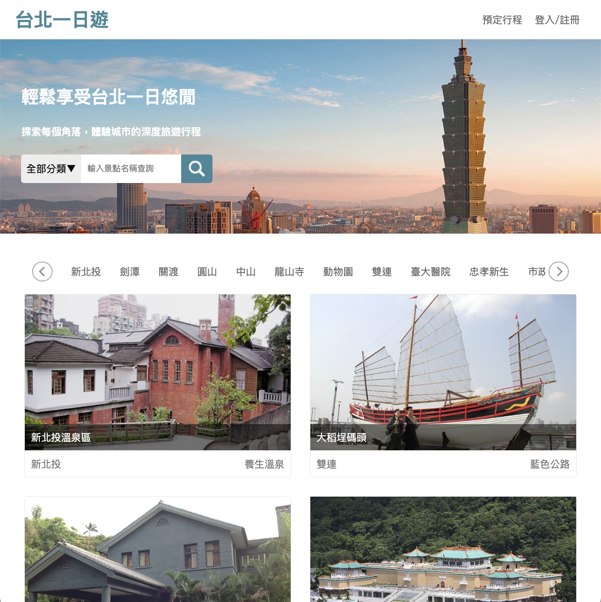
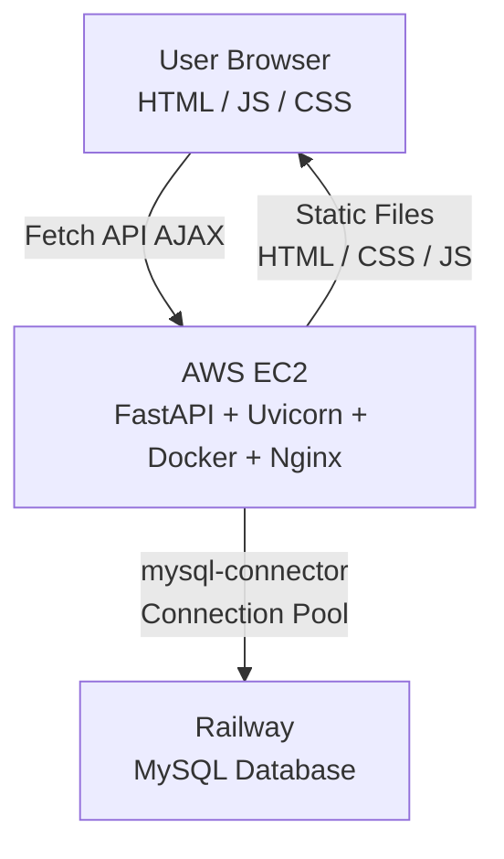

[English](./README.md) | [中文](./README.zh-TW.md)

# 台北一日遊

旅遊電商網站，提供台北景點瀏覽、行程預訂及信用卡付款功能。

**Live Demo：** https://taipei-day-trip.sychcc.net/
**GitHub：** https://github.com/sychcc/taipei-day-trip/



---

## 功能

- **景點瀏覽** — 瀏覽台北景點，每頁 8 筆
- **搜尋 / 篩選** — 支援關鍵字搜尋、分類篩選、捷運站快速搜尋
- **無限滾動** — 使用 IntersectionObserver 自動載入下一頁
- **圖片輪播** — 自製 Slideshow，支援箭頭切換與圓點導覽
- **會員系統** — 註冊 / 登入，使用 JWT 驗證
- **預訂行程** — 選擇景點、日期、時段並建立預訂
- **信用卡付款** — 整合 TapPay SDK 渲染付款欄位，模擬付款流程

---

## 技術架構

### 前端

| 技術                     | 用途                               |
| ------------------------ | ---------------------------------- |
| JavaScript (Vanilla)     | 核心邏輯與互動，無框架             |
| Fetch API (AJAX)         | 非同步資料請求                     |
| IntersectionObserver API | 無限滾動                           |
| localStorage             | JWT Token 儲存                     |
| TapPay SDK (TPDirect)    | 信用卡欄位渲染                     |
| CSS Grid                 | 景點卡片排版（4欄 → 2欄 → 1欄）    |
| RWD (Media Queries)      | 響應式版面（斷點：1250px / 600px） |
| HTML                     | 頁面結構                           |

### 後端

| 技術                   | 用途                                  |
| ---------------------- | ------------------------------------- |
| Python                 | 後端語言                              |
| FastAPI                | Web 框架                              |
| Uvicorn                | ASGI 伺服器                           |
| RESTful API            | API 設計規範                          |
| PyJWT                  | JWT 身份驗證（Bearer Token，7天有效） |
| mysql-connector-python | MySQL 連線池（pool_size=10）          |
| python-dotenv          | 環境變數管理                          |
| MVC Pattern            | 架構模式（controllers/ + models/）    |

### 資料庫

| 技術  | 用途                         |
| ----- | ---------------------------- |
| MySQL | 關聯式資料庫（Railway 托管） |

### 部署

| 技術       | 用途           |
| ---------- | -------------- |
| AWS EC2    | 應用程式伺服器 |
| Docker     | 容器化         |
| Nginx      | 反向代理       |
| CloudFront | HTTPS          |

---

## 系統架構



---

## 資料表設計

```
user (1)
  ├── booking (1)   user_id → user.id  UNIQUE(user_id)
  └── orders  (N)   user_id → user.id

attractions
  └── booking (N)   attraction_id → attractions.id (PK)
```

**設計重點：**

- `attractions` 有兩個 ID 欄位：`id`（PK，資料庫內部使用）和 `_id`（原始資料來源 ID，API 對外使用）
- `booking` 使用 `ON DUPLICATE KEY UPDATE`，一個使用者只能有一筆待預訂行程，新建立的預訂會直接覆蓋舊的
- `orders` 儲存景點資訊快照，保留歷史訂單的正確性
- `orders.status`：`0` = 已付款，`1` = 未付款（建立時預設 `1`）
- 訂單編號格式：`YYYYMMDDHHmmSS` + `user_id`

---

## API 設計

### 景點

| Method | Endpoint                         | 說明                                                    |
| ------ | -------------------------------- | ------------------------------------------------------- |
| GET    | `/api/attractions`               | 景點列表（`?page`, `?category`, `?keyword`，每頁 8 筆） |
| GET    | `/api/attraction/{attractionId}` | 單一景點詳情（以 `_id` 查詢）                           |
| GET    | `/api/categories`                | 景點分類列表                                            |
| GET    | `/api/mrts`                      | 捷運站列表（依景點數量降冪排序）                        |

### 使用者

| Method | Endpoint         | 說明                       |
| ------ | ---------------- | -------------------------- |
| POST   | `/api/user`      | 會員註冊                   |
| PUT    | `/api/user/auth` | 會員登入（回傳 JWT Token） |
| GET    | `/api/user/auth` | 取得當前登入狀態           |

### 預訂行程

| Method | Endpoint       | 說明                     | 認證 |
| ------ | -------------- | ------------------------ | ---- |
| GET    | `/api/booking` | 取得當前使用者的預訂行程 | ✅   |
| POST   | `/api/booking` | 建立 / 更新預訂行程      | ✅   |
| DELETE | `/api/booking` | 刪除預訂行程             | ✅   |

### 訂單

| Method | Endpoint                   | 說明               | 認證 |
| ------ | -------------------------- | ------------------ | ---- |
| POST   | `/api/orders`              | 建立訂單並執行付款 | ✅   |
| GET    | `/api/order/{orderNumber}` | 取得訂單詳情       | —    |

**認證方式：** `Authorization: Bearer <token>` → 403 未登入 / Token 無效

---

## 身份驗證流程

```
登入 PUT /api/user/auth
    email + password → MySQL 驗證
    → PyJWT encode（id, name, email, exp: +7天）
    → 回傳 token → 儲存至 localStorage

每次受保護的請求：
    Authorization: Bearer <token>
    → jwt.decode() → 取得 user_id → 執行業務邏輯
```

---

## 本地開發

### 環境需求

- Python 3.x
- MySQL（本地或 Railway）

### 啟動步驟

```bash
# 1. Clone 專案
git clone https://github.com/sychcc/taipei-day-trip.git
cd taipei-day-trip

# 2. 安裝套件
pip install -r requirements.txt

# 3. 設定環境變數
cp .env.example .env
# 填入你的設定值

# 4. 建立資料表
python create_user_table.py
python create_booking_table.py
python create_orders_table.py

# 5. 匯入景點資料
python load_attractions.py

# 6. 啟動開發伺服器
uvicorn app:app --reload
```

### 環境變數

```env
DB_HOST=your-db-host
DB_USER=your-db-user
DB_PASSWORD=your-db-password
DB_DATABASE=your-db-name
DB_PORT=3306
JWT_SECRET=your-jwt-secret
JWT_ALGORITHM=HS256
TAPPAY_PARTNER_KEY=your-tappay-partner-key
TAPPAY_MERCHANT_ID=your-merchant-id
```

---

## 專案結構

```
taipei-day-trip/
├── app.py                          # FastAPI 主程式 + 路由定義
├── controllers/
│   ├── attraction_controller.py    # 景點邏輯
│   ├── booking_controller.py       # 預訂邏輯
│   ├── order_controller.py         # 訂單 + 付款邏輯
│   └── user_controller.py          # 身份驗證邏輯
├── models/
│   ├── database.py                 # MySQL 連線池
│   ├── attraction.py               # 景點資料存取
│   ├── booking.py                  # 預訂資料存取
│   ├── order.py                    # 訂單資料存取
│   └── user.py                     # 使用者資料存取
├── static/
│   ├── css/
│   │   └── common.css              # 共用樣式（Navbar / Footer / Modal / RWD）
│   ├── js/
│   │   └── auth.js                 # 共用驗證模組
│   ├── img/                        # 圖片資源
│   ├── index.html                  # 首頁
│   ├── attraction.html             # 景點詳情頁
│   ├── booking.html                # 預訂 / 付款頁
│   └── thankyou.html               # 付款完成頁
├── docs/
│   └── landing_page.png
├── data/                           # 景點原始資料
├── load_attractions.py             # 景點資料匯入腳本
├── create_user_table.py
├── create_booking_table.py
├── create_orders_table.py
├── Dockerfile
├── backup.sql
├── requirements.txt
└── .env
```
